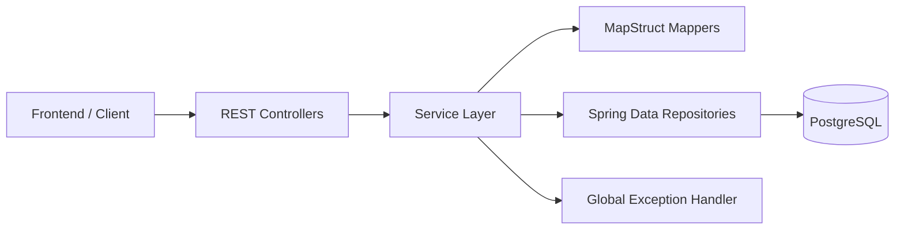
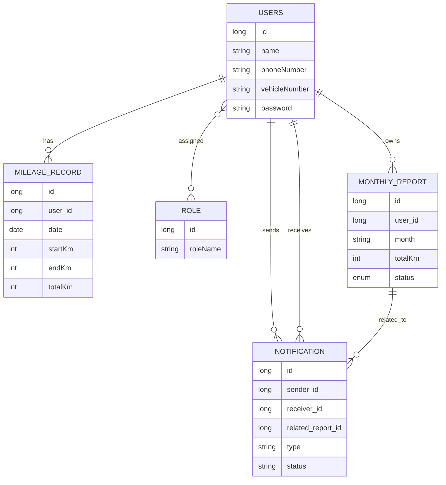
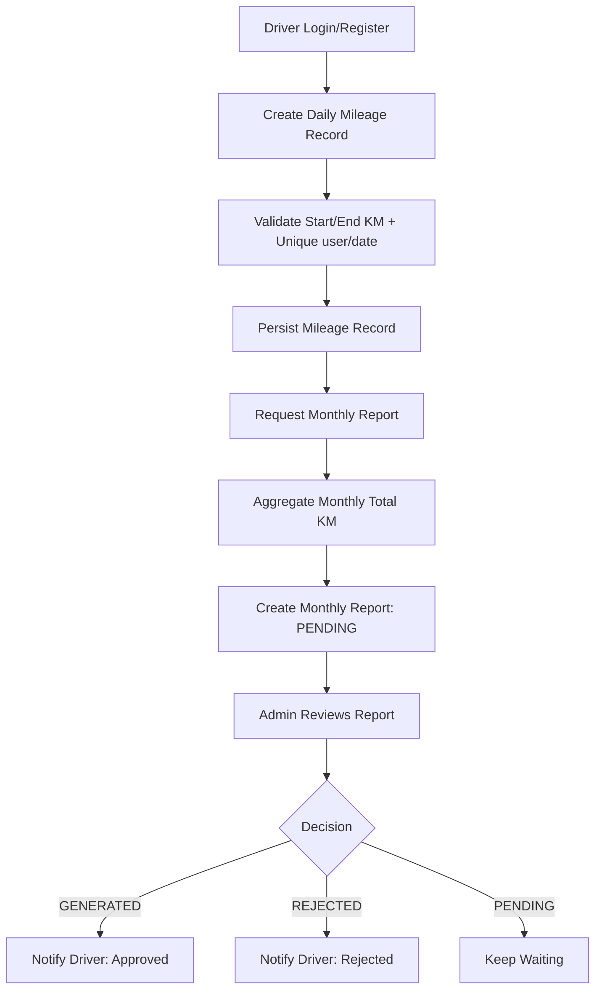

# Driver Mileage Tracker Backend

Spring Boot backend for managing drivers, daily mileage entries, monthly report generation, and report-related notifications.

## Tech Stack
- Java 17
- Spring Boot 3.1
- Spring Web, Spring Data JPA, Spring Security
- PostgreSQL
- MapStruct
- Lombok
- Gradle
- Docker (multi-stage build)

## High-Level Architecture
The project follows a layered architecture:
- `Controller`: REST API entry points
- `Services` + `ServiceImpl`: business logic
- `Repository`: database access via Spring Data JPA
- `Database`: JPA entities (domain/data model)
- `Dto` + `Mappers`: API contracts and entity mapping
- `Exception`: centralized error handling
- `Controller/config`: CORS/security/JWT utility classes



## Package Structure
```text
src/main/java/com/DriverMileageTracker/Backend
|- Controller
|  |- AuthController
|  |- UserController
|  |- RoleController
|  |- MileageRecordController
|  |- MonthlyReportController
|  |- NotificationController
|  |- config (SecurityConfig, JwtUtil)
|- Services / ServiceImpl
|- Repository
|- Database (Users, Role, MileageRecord, MonthlyReport, Notification)
|- Dto
|- Mappers
|- Enum (ROLE, ReportStatus)
|- Exception (GlobalExceptionHandler, ResourceNotFoundException)
```

## Domain Model (Entity Relationship View)


## Core Functional Flow


## Implemented API Areas
- `/api/auth`: login and register
- `/api/users`: user CRUD and profile update (multipart upload for signature/photo)
- `/api/roles`: role CRUD
- `/api/mileage-records`: mileage CRUD, totals, and monthly filtering
- `/api/monthly-reports`: report generation, status updates, pending list
- `/api/notifications`: create, user inbox, mark-as-read

## Configuration
Main config files:
- `src/main/resources/application.properties` (local defaults)
- `src/main/resources/keyur-application.properties` (env-driven values)

Current DB target:
- PostgreSQL on `localhost:5432/DriverMileageTracker` (default local profile)

## Run Locally
Prerequisites:
- Java 17
- PostgreSQL running

Commands:
```bash
./gradlew clean build
./gradlew bootRun
```

Windows PowerShell:
```powershell
.\gradlew.bat clean build
.\gradlew.bat bootRun
```

## Docker
Build and run:
```bash
docker build -t driver-mileage-backend .
docker run -p 8080:8080 driver-mileage-backend
```

## Notes on Current Design
- Security filter currently permits all endpoints (`/**`), so API authorization is effectively open.
- Passwords are encoded with BCrypt during registration/update.
- Mileage records enforce a unique `(user_id, date)` constraint.
- Monthly report creation stores status using `ReportStatus` enum (`PENDING`, `GENERATED`, `REJECTED`).

## Future Scope
1. Security hardening
- Enforce JWT-based authentication/authorization in filters.
- Apply role-based endpoint access (Driver/Admin).
- Move secrets and DB credentials fully to environment/secret manager.

2. Report generation maturity
- Add actual PDF generation and storage integration for `reportFileUrl`.
- Add scheduler for auto-month-end report creation.
- Add audit trail for approval/rejection actions.

3. Notification improvements
- Add real-time push via WebSocket or SSE.
- Add notification categories, pagination, and unread counts.

4. Quality and reliability
- Add unit and integration tests for service and controller layers.
- Add API validation annotations on DTOs.
- Add structured logging, metrics, and health probes.

5. Platform evolution
- Introduce API versioning (`/api/v1`).
- Add OpenAPI/Swagger documentation.
- Consider container orchestration deployment (Kubernetes) and CI/CD pipeline automation.
